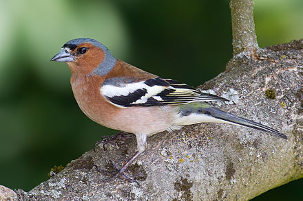
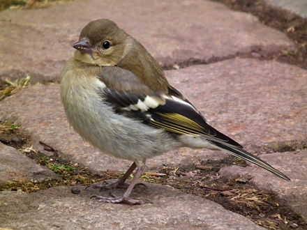

<!-- set default code chunk options -->
```{r setup, include=FALSE}
knitr::opts_chunk$set(echo = FALSE, 
                      warning = FALSE,
                      message = FALSE,
                      fig.retina = 3)
```

<!-- insert code chunk for package loading -->
```{r packages}
library(tidyverse)
```

# Introduction
The mass of male & female chaffinches was measured [@article]. See Figure \@ref(fig:male-fig) & Figure \@ref(fig:female-fig).

<!-- insert image of male chaffinch -->
(ref:male-fig) Image of male chaffinch. By X. https://en.wikipedia.org/wiki/Common_chaffinch

```{r male-fig, out.width = "30%", fig.cap = '(ref:male-fig)'}


```

<!-- insert image of female chaffinch -->
(ref:female-fig) Image of female chaffinch. By X. https://en.wikipedia.org/wiki/Common_chaffinch

```{r female-fig, out.width = "30%", fig.cap = '(ref:female-fig)'}


```

# Methods

```{r import data}
# Imported data
# data organised into two columns depending on sex
chaff <- read_table2("data-raw/more_chaff.txt")
```

```{r tidy data}
# convert data to long form
chaff <- chaff %>% 
  pivot_longer(names_to = "sex", 
               values_to = "mass",
               cols = everything())
```

<!-- sum of squares -->
```{r function SS(x), include = FALSE}
# create function for sum of squares for each sex
sum_sq <- function(df, measure, group) {
  df %>% group_by({{ group }}) %>% 
    summarise(ss = sum(({{measure}} - mean({{measure}}))^2))
}

# find sum_sq for each group
sum_sq(chaff, mass, sex)
```
<!-- summary -->
```{r summarise}
# summarize masses by sex
chaff_summary <- chaff %>% 
  group_by(sex) %>% 
  summarise(mean_index = mean(mass),
            n = length(mass),
            sd = sd(mass),
            se = sd/sqrt(n))

# create function to summarise
data_summary <- function(df, measure, group) {
  df %>% group_by({{ group }}) %>% 
    summarise(mean_index = mean(measure),
              n = length(measure),
              sd = sd(measure),
              se = sd/sqrt(n))
}
```

We measured the mass of male and female chaffinches of `r chaff_summary$n[1]` individuals.
We used R [@R-core] with tidyverse packages [@tidyverse] for all analyses and the rmarkdown [@markdown1] and bookdown [@bookdown] packages for manuscript preparation.

# Results

<!-- difference in masses of sexes -->
```{r extract}
# extract values for inline reporting
highestmean <- max(chaff_summary$mean_index)
highestse <- chaff_summary$se[chaff_summary$mean_index == highestmean]
highestsex <- chaff_summary$sex[chaff_summary$mean_index == highestmean]
lowestmean <- min(chaff_summary$mean_index)
lowestse <- chaff_summary$se[chaff_summary$mean_index == lowestmean]
lowestsex <- chaff_summary$sex[chaff_summary$mean_index == lowestmean]

```

```{r testing}
mod <- aov(data = chaff, mass ~ sex)

# extract values for inline reporting
res <- summary(mod)[[1]]
fval <- round(res$`F value`[1], 2)
df1 <- res$Df[1]
df2 <- res$Df[2]
p <- round(res$`Pr(>F)`[1], 3)
```

```{r posthoc, include=FALSE}
TukeyHSD(mod)
```

There is a significant difference in mass between the sexes (_F_ = `r fval`; _d.f._ =`r df1`, `r df2`; _p_ = `r p`). Post-hoc testing revealed that the `r highestsex` chaffinches had the highest mass ($\bar{x} \pm s.e.$: `r round(highestmean,2)` $\pm$ `r round(highestse,2)` g) and the `r lowestsex` sex had the lowest (`r round(lowestmean,2)` $\pm$ `r round(lowestse,2)` g). See Figure \@ref(fig:mass-fig).
 
<!-- Figure of data -->
(ref:mass-fig) Mean mass of chaffinches. Error bars are $\pm 1 s.e.$

```{r mass-fig, fig.height=4, fig.width=4, fig.cap="(ref:mass-fig)"}

ggplot() +
  geom_point(data = chaff, aes(x = sex, y = mass),
             position = position_jitter(width = 0.1, height = 0),
             colour = "gray50") +
  geom_errorbar(data = chaff_summary, 
                aes(x = sex, ymin = mean_index - se, ymax = mean_index + se),
                width = 0.3) +
  geom_errorbar(data = chaff_summary, 
                aes(x = sex, ymin = mean_index, ymax = mean_index),
                width = 0.2) +
  scale_y_continuous(name = expression("Mass g"), 
                     limits = c(15, 30), 
                     expand = c(0, 0)) +
  scale_x_discrete(labels = c("Females", "Males"), 
                   name = "Chaffinch Sex") +
  theme_classic() +
  theme(axis.title = element_text(size  = 10),
        axis.text = element_text(size = 10))
```

# Discussion
As expected.

# References 
